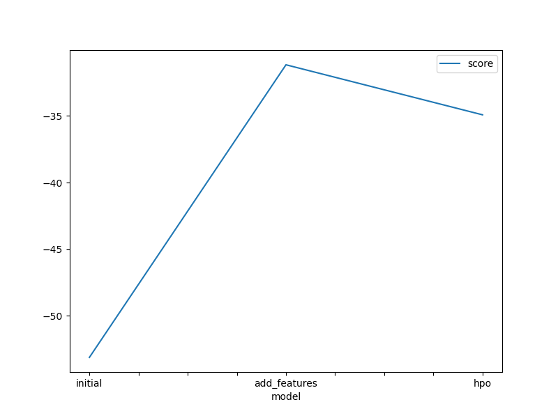
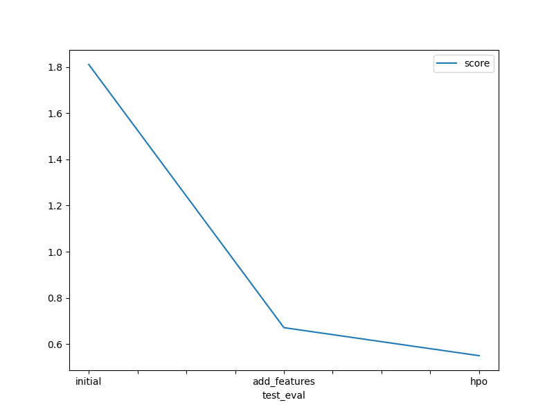

# Report: Predict Bike Sharing Demand with AutoGluon Solution
Ezzeddine Almansoob

## Initial Training
### What did you realize when you tried to submit your predictions? What changes were needed to the output of the predictor to submit your results?
There must be no zero values coz Kaggle do not accept the zero vaules in the submitted file.
### What was the top ranked model that performed?
WeightedEnsemble_L3

## Exploratory data analysis and feature creation
### What did the exploratory analysis find and how did you add additional features?
1-Feature datetime was parsed as a datetime feature to obtain hour information from timestamp.
2-Independent features season and weather were initially read as integer. Since these are categorical variables, they were transformed into category data type.
### How much better did your model preform after adding additional features and why do you think that is?
1-The addition of additional features improved model performance by approximately 62% in comparison to the initial/raw model (without EDA and/or feature engineering) performance.
2-The model performance improved after converting certain categorical variables with integer data types into their true categorical datatypes.
### How much better did your model preform after trying different hyper parameters?
It do much better. Model performance was imporved by approximately 69% in comparison to the initial/raw model (without trying different hyper parameters) and Model performance was imporved by approximately 18% in comparison to the model with additional features.
### If you were given more time with this dataset, where do you think you would spend more time?
Maybe and maybe not. Cause I did my best in preparing them for the  training.
### Create a table with the models you ran, the hyperparameters modified, and the kaggle score.
|model|hpo1|hpo2|hpo3|score|
|--|--|--|--|--|
|initial|default_values|default_values|default_values|1.81062|
|add_features|default_values|default_values|default_values|0.67129|
|hpo|NN_options: num_epochs=5, learning_rate =0.001, activation = relu, dropout_prob =0.1|GBM_options : extra_trees =True, num_boost_round =100, num_leaves =36, ag_args = name_suffix : XT|hyperparameter_tune_kwargs: num_trials =25 , scheduler = local|0.54991|

### Create a line plot showing the top model score for the three (or more) training runs during the project.

### Create a line plot showing the top kaggle score for the three (or more) prediction submissions during the project.

## Summary
When dealing with this kind of problems (regression based one) the most important thing is first understand the probelm. Then, make the data well-prepared for the training phase then after training maybe when we need to add some features or edit thier types .Finally, editing parameters is really important to make the results more 
accurate and desirable.
